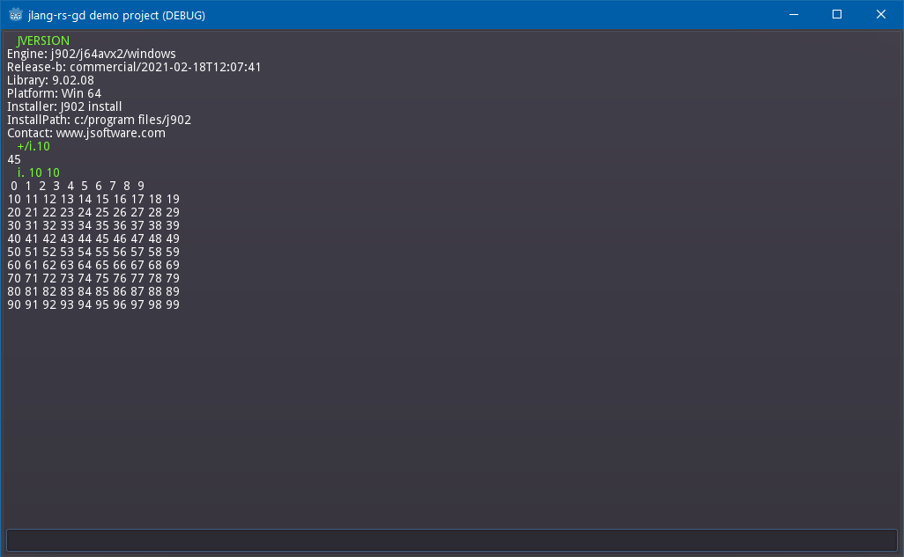

# jlang-rs-gd

[J](https://www.jsoftware.com/#/README) is an extremely high-level mathematical notation and programming language.

[Godot](https://godotengine.org/) is a game / gui / multimedia engine.

**jlang-rs-gd** lets you call J from godot, using a glue layer built in rust.

## requirements

- [rust and cargo](https://doc.rust-lang.org/cargo/getting-started/installation.html) (rust is a programming language, cargo is its build tool)
- [clang](https://clang.llvm.org/) (the godot bindings need this to build)
- [godot](https://godotengine.org/) (I use 4.2.1)
- [j](https://www.jsoftware.com/#/README) (so you have a j dll to call)

## building the dll

The output of the build process is a dll that you need to copy to your Godot project.

    git clone https://github.com/tangentstorm/jlang-rs-gd
    cd jlang-rs-gd
    cargo build

## Running the demo

Once you have a sucessful build, make sure you have `j.dll` on your path somewhere.

    cp target/debug/jlang_rs_gd.dll demo/
    cp j.dll demo/   # if it's not on your path

The run godot and open the project in the `demo/` directory.

## Adding the DLL to your own Godot project

To use this in your own godot project, just copy `jlang_rs_gd.dll` and
`jlang_rs_gd.gdextension`, but note the `.gdextension' file contains
the path to the the `.dll` file relative to the root of your godot project,
so you may need to change that line.

## Running on mac/linux/wasm.

This is windows-only for now, but you may be able to get it running on other platforms yourself.

See here:

https://godot-rust.github.io/book/intro/hello-world.html
